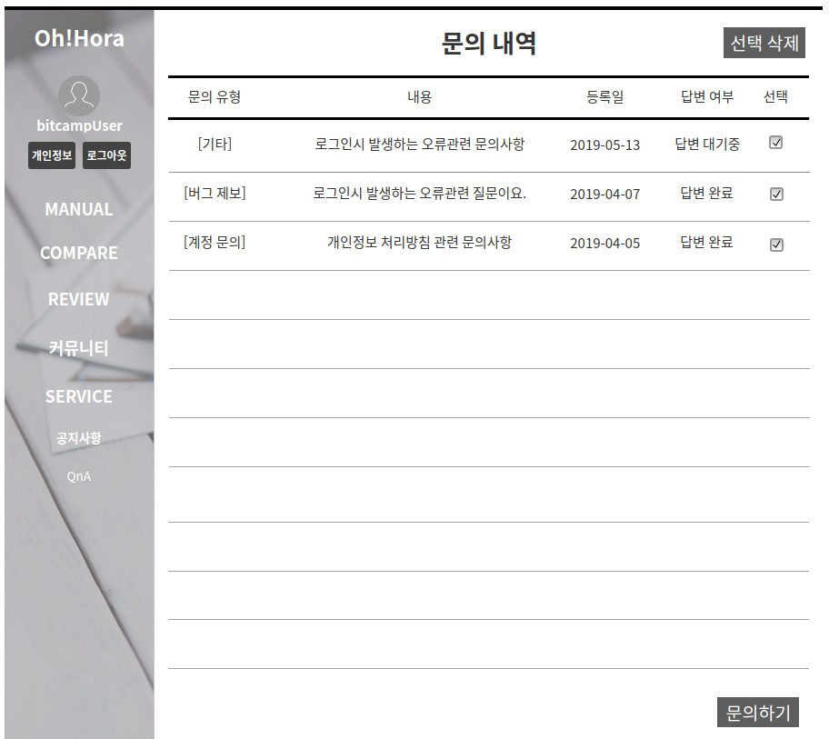
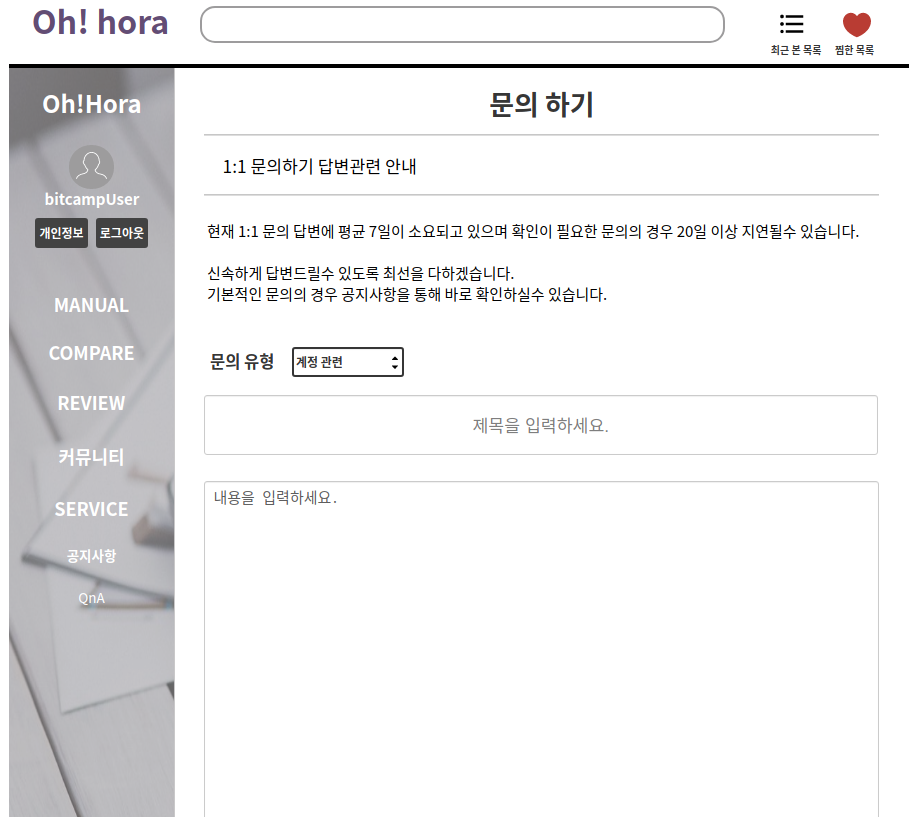
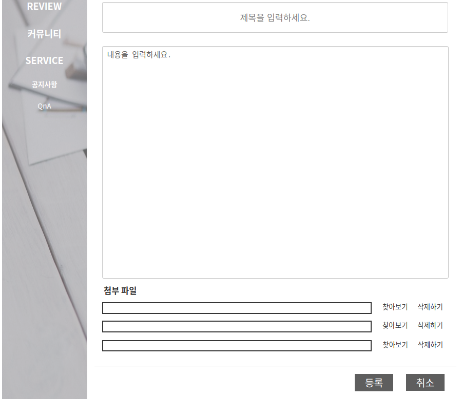
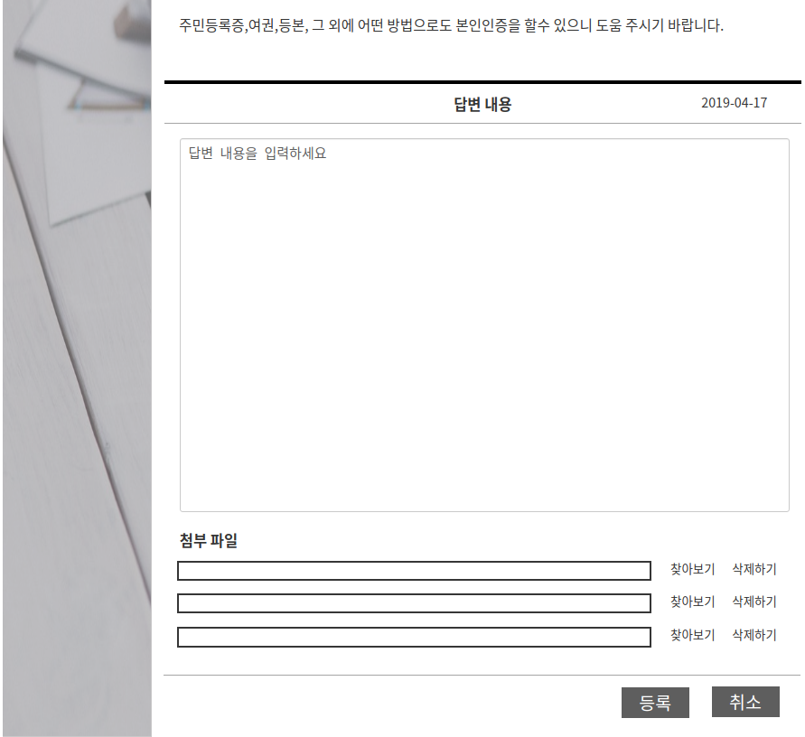
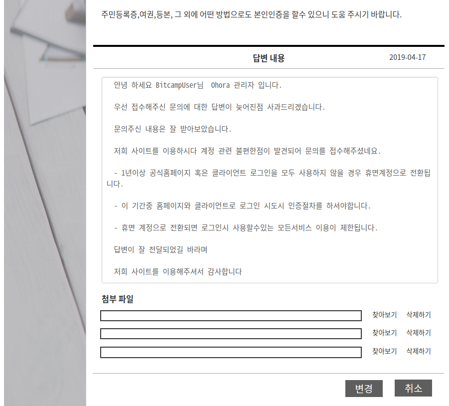

# 질문 답변 관리
질문과 답변을 등록, 조회, 수정, 삭제하는 유스케이스이다

## 주 액터(Primary Actor)
회원, 비회원

## 보조 액터(Secondary Actor)

## 종료 조건(Postconditions)
- 질문을 등록하였다.(회원)
- 질문을 조회하였다.(비회원, 회원)
- 질문을 수정하였다.(회원)
- 질문을 삭제하였다.(회원)
- 등록되어 있는 질문에 답변을 등록하였다(관리자)
- 등록되어 있는 질문에 답변을 수정하였다(관리자)
- 등록되어 있는 질문에 답변을 삭제하였다(관리자)

## 시나리오(Flow of Events)

## 질문 조회하기(비회원, 회원)
1. 액터는 Q&A 매뉴로 들어간다.
2. 시스템은 회원들이 등록한 Q&A 목록(질문의 제목)을 출력한다
3. 액터는 Q&A의 제목을 클릭한다.
4. 시스템은 해당 Q&A의 내용을 출력한다.  

## 질문 등록하기(회원)
1. 액터는 질문 등록 버튼을 클릭한다.
2. 시스템은 질문 등록 폼을 출력한다.
3. 액터는 질문의 내용을 입력하고 등록 버튼을 누른다.
4. 시스템은 질문 정보를 저장한 후 'Q&A 조회하기' 유스케이스의 2번 목록으로 간다.
    - 액터가 질문의 내용을 적지 않았으면,
      - 시스템은 필수 입력 항목이 비어 있음을 알린다.
    - 비회원이 질문을 등록한다면,
      - 시스템은 로그인하라는 메세지를 출력한다.
      
## 질문 변경하기(회원)
1. 액터는 질문의 '수정'버튼을 누른다
2. 시스템은 질문 수정 폼을 출력한다.
  - 질문이 해당 회원이 남긴 댓글이 아니라면,
    - 시스템은 삭제 할 수 없다는 내용의 메세지를 출력한다. 
3. 액터는 질문의 내용을 수정한다.
4. 시스템은 질문의 내용을 변경한 후, '질문 조회하기' 유스케이스의 2번으로 간다.
  - 액터가 질문의 내용을 수정하지 않았으면,
    - 시스템은 수정한 내용이 없다는 내용의 메세지를 출력한다.
      
## 질문 삭제하기(회원)
1. 액터는 질문란에서 삭제 버튼을 클릭한다.
2. 시스템은 질문을 삭제한 후, '질문 조회하기' 유스케이스의 2번으로 간다.
  - 해당 회원이 남긴 질문이 아니라면,
    - 시스템은 삭제 할 수 없다는 내용의 메세지를 출력한다.

### 답변 등록하기(관리자)
1. 시스템은 전체 질문목록을 출력한다.
2. 액터는 미답변된 질문목록보기 카테고리를 클릭한다.
3. 시스템은 시스템은 답변되지 않은 질문목록을 출력한다.
4. 액터는 출력된 질문목록에서 답변할 질문를 클릭한다.
5. 시스템은 해당 질문의 상세정보와 답변폼을 출력한다.
6. 액터는 질문을 읽고, 출력된폼에 답변을 작성한 후 등록하기 버튼을 클릭한다. 
7. 시스템은 등록된 내용을 저장한 후 `질문 답변하기` 유스케이스 3번으로 간다.
    - 질문 답변 입력폼에 작성된 내용이 없을경우,
        - 작성된 내용이 업다고 알린다.

### 답변 수정하기(관리자)
1. 시스템은 전체 질문목록을 출력한다.
2. 액터는 답변된 질문목록보기 카테고리를 클릭한다.
3. 시스템은 답변된 질문목록을 출력한다.
4. 액터는 출력된 질문목록에서 답변 변경할 질문를 클릭한다.
5. 시스템은 해당 질문의 상세정보와 답변을 출력한다.
6. 액터는 출력된질문 상세정보 화면에서 답변변경하기 버튼을 클릭한다.
7. 시스템은 답변 변경 폼을 출력한다.
8. 액터는 답변 변경 폼을 작성한다.
  - 필수 입력항목이 비어있을 경우,
    - 필수 항목이 비어있다는 메세지를 출력한다.
9. 시스템은 답변을 변경한 후 변경했다는 메세지를 출력한다.

### 답변 삭제하기(매니저)
1. 시스템은 전체 질문목록을 출력한다.
2. 액터는 답변된 질문목록보기 카테고리를 클릭한다.
3. 시스템은 답변된 질문목록을 출력한다.
4. 액터는 출력된 질문목록에서 답변 삭제할 질문를 클릭한다.
5. 시스템은 해당 질문의 상세정보와 답변을 출력한다.
6. 액터는 출력된질문 상세정보 화면에서 답변삭제하기 버튼을 클릭한다.
7. 시스템은 해당 답변을 삭제한 후 '질문 답변 삭제하기' 유스케이스의 3번으로 간다.

### 질문답변 UI 프로토타입

