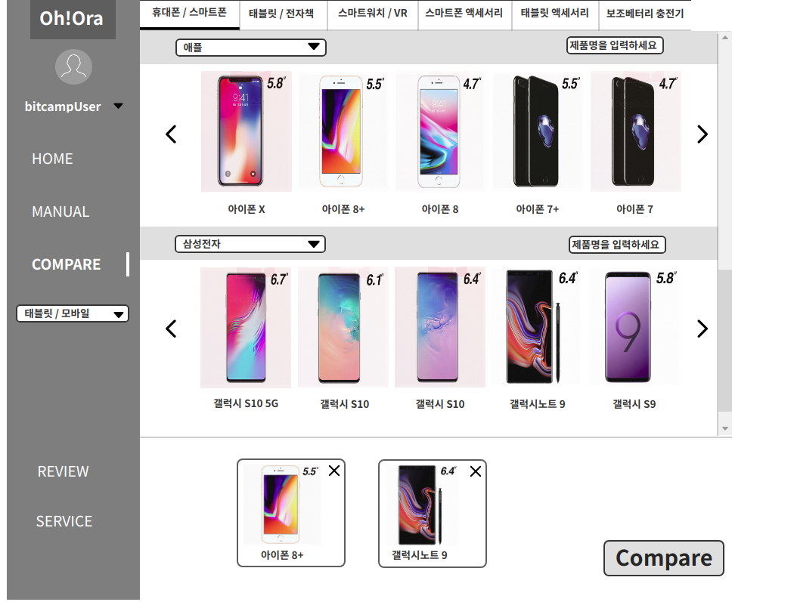

# 컴페어 조회(Compare)
compare결과를 조회하는 유스케이스 이다.

## 주 액터(Primary Actor)
비회원

## 보조 액터(Secondary Actor)

## 사전 조건(Preconditions)
- 비교하고 싶은 제품이 메뉴얼에 등록되어있다.
- 2개이상의 제품이 선택되어있다.

## 종료 조건(Postconditions)
- compare조회를 완료하였다.

## 시나리오(Flow of Events)

### 컴페어 제품 고르기 - 카테고리 선택(비회원)
1. 액터는 compare 카테고리를 선택한다. 
2. 시스템은 드롭다운 방식의제품 카테고리(태블릿/모바일, PC, 카메라)와, 제품명 검색폼을 출력한다.
3. 액터는 출력된 카테고리 목록에서 원하는 제품을 클릭한다(태블릿/모바일).
4. 시스템은 하위 카테고리(휴대폰/스마트폰, 태블릿/전자책,스마트폰 액세서리) 를 출력한다.
5. 액터는 출력된 하위카테고리에서 원하는 제품을 클릭한다.(휴대폰/스마트폰)
6. 시스템은 기업목록(애플, 삼성, LG, 화웨이)폼과, 제품명 검색폼을 출력한다.
    - 만약 액터가 출력된 기업목록에서 원하는 기업을 클릭한다면(애플).
        - 시스템은 제품목록을 출력한다(아이폰x,아이폰...).
    - 만약, 액터가 검색바에서 원하는 제품의 키워드를 입력한다면(아이폰X)
        - 시스템은 해당 키워드와 일치하는 제품 목록을 출력한다.
        - 해당 키워드에 일치하는 제품이 없다면,
            - 시스템은 일치하는 제품이 없다고 알린다.

7. 액터는 출력된 제품목록에서 원하는 제품을 클릭한다.(아이폰x)
    - 액터가 제품을 하나만 골랐을 경우, 최소 2개이상의 제품을 compare해야하기 때문에 시스템은 컴페어 제품고르기(카테고리 선택) 유스케이스 6번부터 반복
    - 액터가 2개이상의 제품을 고른후에 `+` 버튼을 클릭하면,
        - 시스템은 제품목록폼을 하나더 출력한후, 컴페어 제품고르기(카테고리 선택) 유스케이스 6번부터 반복한다.
8. 2개이상의 제품이 선택된후 액터가 **COMPARE** 버튼을 클릭한다.
9. 시스템은 'compare조회' 유스케이스로 넘어간다.

### compare 조회 (비회원)
1. 기본이 제품스펙 카테고리이기 때문에, 시스템은 컴페어 제품 고르기에서 고른 제품들의 매뉴얼에 있는 스펙을 출력한다.
2. 액터가 가격정보 카테고리를 클릭한다.
3. 시스템은 제품가격 비교정보를 출력한다.
4. 액터가 만족도 카테고리를 클릭한다.
5. 시스템은 리뷰 카테고리에서 가져온 해당 제품의 만족도 비교정보를 출력한다.
    - 해당 리뷰가 작성되어있지 않을경우,
        - 시스템은 만족도비교정보가 등록되지 않다고 알린다.
6. 액터가 댓글 카테고리를 클릭한다.
7. 시스템은 메뉴얼 카테고리에서 가져온 댓글 목록을 출력한다.

### compare 폼
